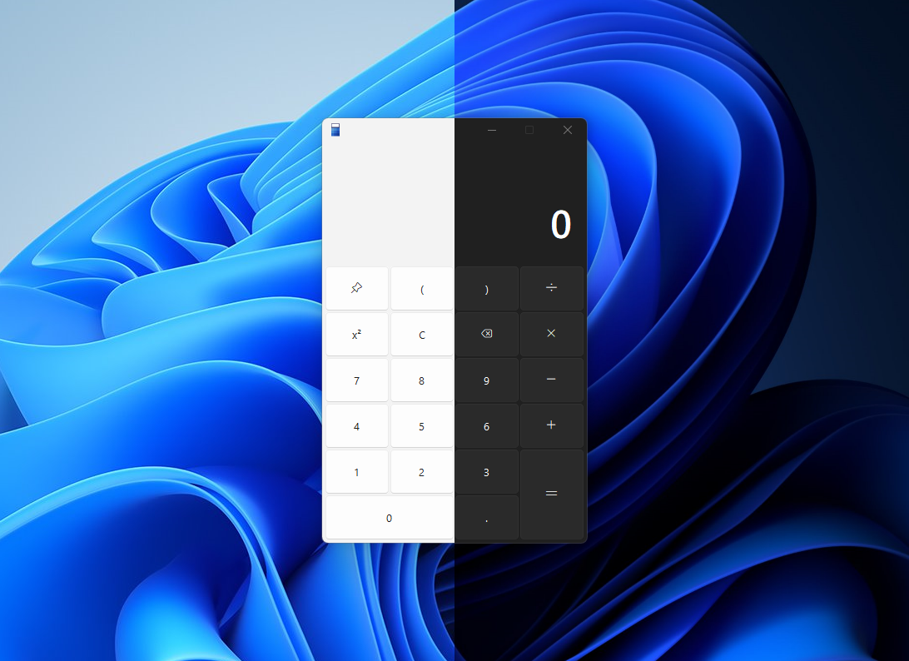

    </a> 
    <h1>Fluent Python Calculator<h1>    
    
    

  

     
## About Fluent-Python-Calculator:
  A very simple calculator with a modern UI made in Python thanks to the stunning [Sun-Valley-ttk-theme](https://github.com/rdbende/Sun-Valley-ttk-theme) and Segoe UI Variable font.

## Works for:
- Windows 10* and Windows 11.

>*Need the Segoe UI Variable font to work proprely!
 

### Future development
 - [X] Big UI redesign!
 - [X] Improve button size
 - [X] Add 'error' message into the app
 - [X] Improve UI (thanks for @sumeshir26, @not-nef, and @im-coder-lg)
 - [X] Add proper changing dark/light mode (thanks for [Timothy Malahy](https://github.com/TimothyMalahy))
 - [X] Change to exe? (done)
 - [X] Add icon
 - [X] Add backspace (thanks for @RivanParmar for suggesting me) 
 
### Other awesome repositories:
- <a> [TimerX](https://github.com/Futura-Py/TimerX)
- [Sun-Valley-ttk-theme](https://github.com/rdbende/Sun-Valley-ttk-theme)
